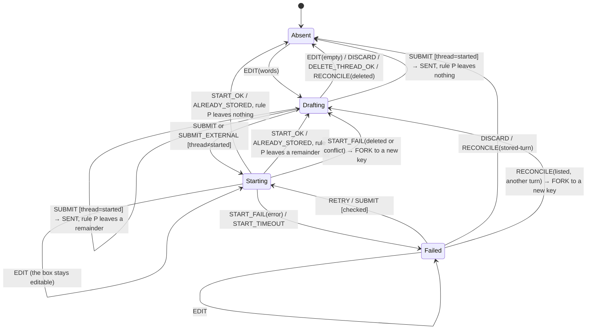

<!-- SPDX-FileCopyrightText: 2026 Alethia Labs <legal@alethialabs.io> -->
<!-- SPDX-License-Identifier: AGPL-3.0-only -->

# Elench drafts: one state machine, keyed by a conversation id that never changes

**Status:** proposed (2026-10-04, revision 2 after the design review on #5512) · **Issue:** #5464 · **Supersedes:** the draft store reverted from #5423 (head 2c1314267)

**Decision (proposed).** An unsent Elench message is an entry in one client-side store, keyed by
`(viewer, org, anchor, conversationId)`. The `conversationId` is the thread id from the moment the
conversation is created on screen: the client mints it, and `createThread` inserts the row under
that id. No transition merges or relocates an entry, and the one transition that re-keys (FORK)
moves the words to a fresh key and never into an existing one. The composer is only a *view* of its
entry, so a remount is not an event. The store is held in memory and mirrored to `sessionStorage`
**one key per conversation**, inside a byte budget of its own. A failed or refused write removes
that key, so storage is never staler than memory. Words leave the store only through the
transitions listed in invariant I3. Nothing evicts an entry. Drafts are **not** stored server-side
(see §6).

**Why.** #5423 grew a draft store over eight review rounds, and the patches followed a pattern:
keyed by lineage, then by conversation, then relocation, sent-pruning, tombstones, a cap, and
last-thread memory. Each fix opened the next blocker. Nearly every blocker sits in one of three
classes, and this design removes each class instead of patching its instances:

| Class | Blockers it produced on #5423 | Removed by |
|---|---|---|
| A key that changes under the words (epoch, `new` slot, relocation) | 4173571375, 4173571377, 4174362779, 4174713084, 4174713086 | Invariant **I2**: the key is the conversation id, fixed at birth |
| Two editable copies of one message (the box vs. `pending`/`failedStart`) | 4173297525, 4173404109, 4174362779 | Invariant **I1**: one editable text per conversation |
| A whole-map snapshot that diverges from memory after a failed write | 4174550045, 4174713084, 4174713086, 4174130695 | Invariant **I4**: per-key mirror, remove-on-fail |

The fourth #5423 failure, a first send that is billed twice or answered into no thread (4173024467),
is not a client class. It is removed by giving `createThread` a server-side outcome for every way a
start can meet an existing row (§3, "Start outcomes").

---

## 1. Context: what the code does today (dev @ 857794cb9)

Every statement below was read from the tree; the line numbers are for that commit. They were
re-checked against `origin/dev` @ fbe2409c8: none of the cited files changed between the two.

- **The draft is the composer's own Lexical state.** `ElenchComposer` reads `seed` once at mount
  (`apps/console/components/agent/elench/elench-composer.tsx:67-77`) and clears the editor after a
  send only when it still holds exactly the sent text (`elench-composer.tsx:188-193`). Anything
  that unmounts the composer drops the words.
- **Five things unmount the composer:**
  1. *Minimize/maximize.* `ElenchConversation` returns `<ElenchModal>` or `<ElenchPanel>` around
     the same `body` (`elench-conversation.tsx:502-531`). A view flip changes the parent element
     type, so the body remounts. The `useChat` instance lives above that branch
     (`elench-conversation.tsx:200-214`), so the store's "Flipping never remounts the chat"
     (`apps/console/lib/stores/use-elench-store.ts:100`) is true of the transcript and false of the
     composer.
  2. *Landing to docked.* The modal landing has its own composer
     (`elench-empty-landing.tsx:116-122`). It is rendered only while `isEmpty`
     (`elench-conversation.tsx:440`).
  3. *Close.* `ElenchSurface` returns `null` when `!open` (`elench-surface.tsx:21`). `close()` only
     sets `open: false` (`use-elench-store.ts:242`).
  4. *Lineage change.* The body's error boundary is keyed by `epoch`
     (`elench-conversation.tsx:435`). `selectThread` and `newChat` bump it
     (`use-elench-store.ts:264-272`), and so do `openPanel`/`openModal` when the requested context
     differs from the current one (`use-elench-store.ts:209-238`; `togglePanel`, `:244-248`, calls
     `openPanel`).
  5. *Reload.*
- **A failed first send is component state.** `useElenchSend` keeps the pending turn in
  `useState`/`useRef` (`apps/console/components/agent/elench/use-elench-send.ts:72-78`) and reuses
  its id across retries (`use-elench-send.ts:92`). `ElenchConversation` resets it on every lineage
  change (`elench-conversation.tsx:270-273`). Retry submits the composer, and puts the failed
  attempt's state back when the box is empty (`elench-conversation.tsx:284-298`). So a close, a
  thread switch, New chat or a reload loses it.
- **Mentions travel through a global slot.** `beforeSend` stages the composer's mentions in the
  store's `pendingMentions` (`elench-conversation.tsx:244-255`), and `prepareBody` reads that slot
  when the request body is built (`elench-conversation.tsx:158-195`). Whatever was staged last is
  what the next request carries.
- **Too-long is cleared only by a successful send.** `setError(null)` runs only on a send that went
  out (`use-elench-send.ts:116`).
- **Reopen resumes `resumeIdRef.current ?? list[0]`** (`use-elench-threads.ts:83`). An ephemeral
  conversation has a null id, so reopening lands on the newest thread.
  Neither `listThreads` (`use-elench-threads.ts:80`) nor the `getThread` inside `loadInto`
  (`use-elench-threads.ts:51`, awaited at `:84`) has a `catch`. A rejection of either leaves
  `initialResolved` false, and the body stays on the skeleton.
- **Artifact "Open in new chat" creates a row eagerly with no messages**
  (`elench-conversation.tsx:373-380`). `listThreads` hides zero-message rows and deletes them after
  an hour (`apps/console/app/server/actions/agent.ts:128-143`, `:154`). `getThread` returns null
  for a tombstone and for a missing row alike (`agent.ts:162-172`).
- **`createThread` is idempotent by a read-then-insert** on `messages->0->>'id'`
  (`agent.ts:67-90`). The lookup matches `kind` and liveness but not `project_id`, and on a match it
  rewrites title and turn while the row holds one message (`agent.ts:79-89`). The server mints the
  row id (`lib/db/schema/agent.ts:24`, `uuid().primaryKey().defaultRandom()`).
- **The chat routes save the client's transcript wholesale.** `/api/agent` streams with
  `originalMessages: messages` from the request (`app/api/agent/route.ts:282`) and its `onFinish`
  saves the finished list over the thread (`route.ts:376-381`). A second tab that sends with a stale
  copy therefore overwrites the first tab's turns.
- **Org-level threads are user-scoped, not org-scoped.** `createThread` writes
  `org_id: owner` (`agent.ts:97`), and `withOwnerScope` sets both RLS variables to the user
  (`apps/console/lib/db/index.ts:93-98`). The same org-level thread is therefore listed in every org
  the user switches to.
- **The chat routes take their tenant from the session, not the tab.** `/api/agent` and
  `/api/projects/[projectId]/assistant` call `currentActor()` (`route.ts:171`;
  `assistant/route.ts:181`), and reserve the AI budget hold under `actor.orgId` (`route.ts:201`;
  `assistant/route.ts:205`). `currentActor()` prefers the org named in the URL and falls back to
  the session's `active_organization_id` where the address names none, which includes `/api/**`
  (`lib/authz/guard.ts:27-38`; `lib/authz/org-scope.ts:24-25`). The session value is shared by
  every tab, and `switchOrg` writes it (`lib/stores/use-workspace-store.ts:50-51`).
- **The Elench store is a module singleton with no org field** (`use-elench-store.ts:97-186`).
  `AppShell`, which mounts `ElenchSurface`, is mounted by `app/(private)/[org]/layout.tsx`
  (`components/shell/app-shell.tsx:6`, `:126`). An org switch can therefore remount the hooks while
  `open`, `ctx` and `threadId` carry over. A test must confirm this; it is inferred from the code,
  not observed.
- **Personal orgs share the URL segment `~`**, so the org slug alone does not identify a person
  (`use-elench-draft-owner.ts` at 2c1314267, and `useActiveOrgSlug`,
  `lib/stores/use-workspace-store.ts:123-135`).
- **The signed-in person is observable.** `useViewer()` is the console's one reader of
  `authClient.useSession()` and answers the live session once hydrated
  (`components/providers/viewer-provider.tsx:86-100`). The profile menu's sign-out calls
  `authClient.signOut()` (`components/shell/sidebar-profile.tsx:76`).
- **Other console features keep unsaved work in `sessionStorage`.** The design canvas draft is a
  zustand `persist` store on `sessionStorage` (`lib/stores/use-canvas-store.ts:503`, `:1302`), and
  it is the only autosave a design has (`design-project-canvas.tsx:411`,
  `e2e/architecture-canvas.spec.ts:398-399`). The pending paid-org setup, with the billing address
  the customer typed, is there too (`components/org/pending-paid-setup.ts:189-237`). The quota is per
  origin, so every feature draws on one budget.

## 2. Vocabulary

- **Conversation**: one thing on screen that can hold a transcript. It has a **conversation id**
  (a UUID), minted by the client at New chat, Open in new chat or first open. That id is also the
  thread id.
- **Thread status** of a conversation, as far as the client knows:
  - `local`: no row was ever created.
  - `started`: the row exists.
  - `gone`: the row was created, and the server now reports it absent.
- **Scope**: `(viewerId, orgSlug, anchor)`, where `anchor` is `org` or `project:<id>`. A **key** is
  scope plus conversation id. The scope's org id is resolved once, when the scope is entered.
- **Draft**: the text, mentions and serialized editor state that the composer of a conversation
  shows. It is the one editable text of the conversation.
- **Start**: the first-send attempt of a `local` or `gone` conversation. Its fields are a `turnId`,
  minted once; a `phase` (`in-flight` or `failed`); `sent`, the immutable snapshot of what the
  current attempt submitted; `external`, non-null only when the turn did not come from the composer
  (a suggestion card, a seed prompt or a grid cell); `attempt`, the id of the call in flight; and
  `checked`, whether the server has been asked about this start since the realm began.
- **Realm**: one JS realm (a page load). `realmId` is minted at module load and never persisted,
  so a reload and a duplicated tab are each a new realm.
- **Unsent**: a conversation that holds words and is not `started` and listed. The rail shows it in
  an "Unsent" group (see §9, Q3).

## 3. The state machine

One machine per key. The entry is:

```ts
interface Snapshot { text: string; mentions: Mention[] }

interface DraftEntry {
  key: DraftKey;                       // immutable (I2)
  rev: number;                         // bumped by every transition that is not an EDIT (I9)
  thread: "local" | "started" | "gone";
  draft: { editor: string; text: string; mentions: Mention[] } | null;
  start: {
    turnId: string;
    phase: "in-flight" | "failed";
    sent: Snapshot;                    // what the current attempt submitted; never editable (I1)
    external: Snapshot | null;         // non-null for a suggestion, seed or cell prompt
    attempt: string | null;            // the call in flight; null when phase = failed
    checked: boolean;                  // false for a start restored by LOAD until RECONCILE
  } | null;
  artifacts: string[];                 // pending Open-in-new-chat placements (local only)
  title: string | null;                // last known title, for the Unsent label
  at: number;
}
```

Entry state is a derived value:

- **Absent**: no entry.
- **Drafting**: `draft` holds words, and `start` is null.
- **Starting**: `start.phase` is `in-flight`.
- **Failed**: `start.phase` is `failed`.

`thread` is a guard on transitions. It is not a separate machine. Persistence (`saved` or
`unsaved`) is tracked beside the entry, in a memory-only set.



### Events

| Event | Raised by |
|---|---|
| `OPEN_NEW(scope)` | New chat. Mints a fresh id, unless the active conversation is already an empty `local` one. |
| `OPEN_ARTIFACT_NEW(scope, artifactId)` | Artifact "Open in new chat". Mints an id and records the artifact. |
| `SELECT(key)` | Rail, recents, switcher, reopen, reload. Changes `activeKey[scope]` only. |
| `EDIT(key, rev, editor)` | Composer update, stamped with the `rev` the composer was seeded at. Memory is written on every update; storage is debounced (§4). |
| `SUBMIT(key)` | Enter, Send, and Retry of a composer-origin start. |
| `SUBMIT_EXTERNAL(key, text, mentions)` | Suggestion card, seed prompt, grid cell prompt. |
| `START_OK(key, attempt)` / `ALREADY_STORED(key, attempt, storedText)` / `START_FAIL(key, attempt, reason)` | The `createThread` outcome (see "Start outcomes"). `reason` is `deleted`, `conflict` or `error`. |
| `START_TIMEOUT(key, attempt)` | 30 s after the attempt was sent with no outcome. |
| `SENT(key, sentText)` | Hand-off to `sendMessage`, `START_OK` or `ALREADY_STORED`. |
| `RETRY(key)` | The thread-start card's Retry. |
| `DISCARD(key)` | An explicit Discard on the card or the Unsent entry. It is undoable through a toast. |
| `DELETE_THREAD_OK(conversationId)` | `deleteThread` resolved in this tab. It names a conversation, not a key. |
| `RECONCILE(key, status)` | After a successful `listThreads`/`threadStatuses`. `status` is `listed(firstId)`, `unlisted`, `absent`, `deleted` or `stored-turn`. |
| `PERSIST_OK(key)` / `PERSIST_FAIL(key)` | The storage adapter, including a write the budget refused (§4). |
| `LOAD(scope)` / `SCOPE_CHANGE(scope)` | Surface mount, reload, org or account switch, and an anchor change: `openPanel`/`openModal`/`togglePanel` with a context other than the current one (`use-elench-store.ts:209-248`). |
| `VIEWER_CHANGE(prev, next)` | `useViewer()` answering a different person, or nobody, than the entries in memory belong to: the menu's sign-out, a session expiry or revocation, or a sign-out in another tab once this tab's session read notices it. |

### Start outcomes

`createThread(title, projectId, firstTurn, id, realmId)` inserts with `ON CONFLICT (id) DO NOTHING`.
The first message carries `metadata.startRealm = realmId`. When the insert writes nothing, the
server reads the conflicting row by id under the owner's RLS scope, tombstones included, and returns
exactly one outcome. The client never chooses between them:

| The conflicting row | Outcome | Client event |
|---|---|---|
| none (the insert wrote it) | `created` | `START_OK` |
| a tombstone | `deleted` | `START_FAIL(deleted)` |
| `kind ≠ "agent"`, or `project_id` differs from the request's (null-safe), or zero messages | `conflict` | `START_FAIL(conflict)` |
| first message id ≠ `turnId` | `conflict` | `START_FAIL(conflict)` |
| first message id = `turnId`, more than one message | `already-stored` | `ALREADY_STORED` |
| first message id = `turnId`, one message, `startRealm` ≠ `realmId` | `already-stored` | `ALREADY_STORED` |
| first message id = `turnId`, one message, `startRealm` = `realmId` | `rewritten`: title and turn replaced with this attempt's (it may carry edited text) | `START_OK` |

Only the last row ever leads to a second `sendMessage` for a turn id, and it requires the same
realm. Within one realm I7 allows one attempt at a time, and `sendMessage` runs only after the
attempt's own `START_OK`, so a one-message row from this realm is a committed start whose response
was lost and that nothing has answered. A one-message row from another realm may be a reply that is
streaming in another tab, or a start from before a reload. Either way, this realm does not send it:
it shows the stored turn, and the transcript's own "No reply arrived" + Retry
(`elench-conversation.tsx:223-230`) lets the user re-run it while looking at it.

### Transitions

| # | From | Event | Guard | To | Effects |
|---|---|---|---|---|---|
| T1 | any | `OPEN_NEW` | the active conversation is `local` and Absent | (same key) | none: no clutter |
| T2 | any | `OPEN_NEW` | otherwise | new key, Absent | `activeKey[scope] := k'`. **The old entry is untouched.** |
| T3 | any | `OPEN_ARTIFACT_NEW` | — | new key, Absent, `artifacts=[a]` | entry persisted, so the artifact chip survives a reload. No row is created. |
| T4 | any | `SELECT(k)` | `k.scope = current` | unchanged | `activeKey[scope] := k`. Composer remounts with `key=k` and seeds from the entry. |
| T5 | Absent/Drafting | `EDIT(rev, words)` | `rev = entry.rev` (Absent: 0) | Drafting | memory now, storage debounced. A stale `rev` is dropped (I9). |
| T6 | Drafting | `EDIT(rev, empty)` | `rev = entry.rev`, `artifacts=[]` | Absent | `removeItem(k)` |
| T7 | Starting/Failed | `EDIT(rev)` | `rev = entry.rev` | same | the draft is updated; `start`, including `start.sent`, is kept |
| T8 | Drafting | `SUBMIT` | `thread=started` | via `SENT` | `sendMessage(newId, {body: {mentions}})` with the box's text and mentions |
| T9 | Drafting/Failed | `SUBMIT` | `thread≠started`; text non-empty and not too long; `external=null`; Failed requires `checked` | Starting | `turnId` is reused if present. `start.sent := {text, mentions}` from the box; `attempt := new`. `createThread(title, projectId, {id: turnId, text}, k.id, realmId)` |
| T10 | Starting | `SUBMIT`/`RETRY`/`SUBMIT_EXTERNAL` | — | Starting | refused (I7). `SUBMIT_EXTERNAL` raises "Wait for the message that is being sent." |
| T11 | Failed | `SUBMIT` | box empty, `external=null` | Failed | nothing is sent. The card says the box is empty (Q4). |
| T12 | Starting | `START_OK(attempt)` | `attempt = start.attempt` | via `SENT(start.sent.text)` | `thread:=started`; `start:=null`. `sendMessage(turnId, start.sent.text, {body: {mentions: start.sent.mentions}})` runs **only if** `k` is mounted and active; otherwise the stored turn shows "No reply arrived" + Retry on open (`elench-conversation.tsx:223-230`). Pending `artifacts` are placed, and on failure a toast names the artifact. For an external start the box is untouched (rule P compares `draft` with `sent`, which is not the box's). |
| T13 | Starting | `START_FAIL(attempt, error)` | `attempt = start.attempt` | Failed | `attempt := null`. The draft is untouched. The card says where the words are. |
| T14 | Starting | `START_FAIL(attempt, deleted)` | `attempt = start.attempt` | Drafting or Failed under `k''` | **FORK** (below). Notice: "That conversation was deleted. Your message is kept in a new one." |
| T15 | any with a draft | `SENT(k, s)` | — | Absent or Drafting | **Rule P** (below). Then persist or remove `k`; `rev += 1`. |
| T16 | Failed | `RETRY` | `external≠null`, `checked` | Starting | `start.sent := external`; send it. The card shows that text, so Retry sends what it states. |
| T17 | Failed | `RETRY` | `external=null` | as `SUBMIT` | Retry is Enter |
| T18 | Drafting/Failed | `DISCARD` | — | Absent | `removeItem(k)`; `rev += 1`. If `start≠null` and any attempt was sent from it, `deleteThread(k.id)` runs, because a lost response may have committed the words to a row. The undo toast holds the entry for one toast lifetime, and Undo restores it through **FORK**, never under `k`, so it never meets the tombstone the delete just wrote. Starting cannot be discarded: the card shows "Sending…" with no Discard until the outcome or T30. |
| T19 | any | `DELETE_THREAD_OK(id)` | — | Absent, for **every** key of this viewer whose conversation id is `id`, in every scope | memory and storage (a prefix scan of the viewer's storage items). The confirm dialog counts the unsent messages across all of those keys and names how many orgs they are in. |
| T20 | any | `RECONCILE(listed(firstId))` | — | see effects | `thread := started`. If `start=null`: nothing else. If `start≠null` and `firstId = start.turnId`: as T24. If `start≠null` and `firstId ≠ start.turnId`: another realm started this conversation with other words, so **FORK**, with "This conversation was started in another tab. Your message is kept in a new one." |
| T21 | any | `RECONCILE(unlisted)` | the row is live but has 0 messages | unchanged; shown under Unsent | — |
| T22 | `started` | `RECONCILE(absent)` | — | `thread:=gone`; shown under Unsent | notice: "'<title>' is no longer available. Your unsent message is kept under Unsent." Never "deleted". |
| T23 | any | `RECONCILE(deleted)` | a tombstone exists | Absent | notice: "Discarded the unsent message of a conversation you deleted." |
| T24 | Failed/Drafting | `RECONCILE(stored-turn)` | the server row's first message id is `start.turnId` | Absent or Drafting | as `ALREADY_STORED`: `thread:=started`, `start:=null`, **no** `sendMessage`; rule P runs against the stored text. |
| T25 | — | `PERSIST_FAIL(k)` | — | unchanged | `removeItem(k)`, then add `k` to `unsaved`. A notice is raised when `unsaved` goes from ∅ to non-∅. |
| T26 | — | `PERSIST_OK(k)` | — | unchanged | remove `k` from `unsaved` |
| T27 | — | `LOAD(scope)` | — | entries of the scope | First, every `alethia:elench:` item whose viewer is not the current viewer is removed (T29). Then the scope's items are read by prefix. Each value is zod-validated; an invalid one is reported and removed. A restored start is always `phase: failed`, `attempt: null`, `checked: false` (§4 never persists `in-flight`). Then `RECONCILE` runs after the server answers. |
| T28 | — | `SCOPE_CHANGE(s')` | — | — | the selector shows only `s'`. `activeKey := activeKey[s']`, also for an anchor change. In-flight effects carry their own key and never read the active one. |
| T29 | — | `VIEWER_CHANGE(A, B or none)` | — | all of A's entries are Absent | memory and storage cleared. The menu's sign-out confirms first when A has unsent words (Q8). |
| T30 | Starting | `START_TIMEOUT(attempt)` | `attempt = start.attempt` | Failed | `attempt := null`. The card offers Retry. A late outcome for this attempt is now stale (T31). |
| T31 | any | `START_OK`/`ALREADY_STORED`/`START_FAIL` | `attempt ≠ start.attempt`, or no entry | unchanged | dropped. Its effect on the server is found by the next `RECONCILE`, or by the next attempt's outcome. |
| T32 | Absent/Drafting | `SUBMIT_EXTERNAL(text, mentions)` | `thread≠started`, not too long | Starting | `start := {turnId: new, sent: {text, mentions}, external: {text, mentions}, attempt: new}`. `createThread` with that text. The box is untouched. |
| T33 | Absent/Drafting | `SUBMIT_EXTERNAL(text, mentions)` | `thread=started` | unchanged | `sendMessage(newId, text, {body: {mentions}})`. The box is untouched. |
| T34 | Starting | `ALREADY_STORED(attempt, storedText)` | `attempt = start.attempt` | via `SENT(storedText)` | as T24: `thread:=started`, `start:=null`, **no** `sendMessage`. The stored turn shows as unanswered until a reply exists. |
| T35 | Starting | `START_FAIL(attempt, conflict)` | `attempt = start.attempt` | Drafting or Failed under `k''` | **FORK**, with "This conversation was started in another tab. Your message is kept in a new one." Never a rewrite. |
| T36 | Failed | `SUBMIT_EXTERNAL` | — | Failed | refused. The card reads "Send or discard the message above first." Nothing is replaced. |
| T37 | Failed | `SUBMIT` | `external≠null` | Failed | refused. The card reads "Retry or discard the suggested message first. Your text stays in the box." (Q11) |
| T38 | Failed | `RETRY`/`SUBMIT` | `checked = false` | Failed | queued until this key's `RECONCILE` lands (the card reads "Checking whether it was sent…"), then re-evaluated. If the status call fails, `checked := true` and the queued event runs: the start-outcome table makes that safe, because a row written by another realm answers `already-stored`. |

**FORK(k).** The one re-key. It mints `k''` in the same scope with `thread = local`, and carries:
- `draft` if it holds words; otherwise, for a composer-origin start, `start.sent` as the draft;
- for an external start, `start := {turnId: new, phase: failed, sent: external, external, attempt: null, checked: true}`, so the card and its Retry come with it;
- `artifacts` and `title`.

The result is never Absent, because `start.sent` is non-empty by T9/T32. `setItem(k'')` runs, then
`removeItem(k)`. `activeKey[scope]` moves to `k''` only if it was `k`.

**Rule P (what a send removes from the box).** `s` is the text that went out: `start.sent.text` for
T12, the stored text for T24/T34, the submitted text for T8. Rule P runs only for a composer-origin
send (T33 and an external T12 leave the box alone). If `draft.text` equals `s`, the draft is
removed. If `draft.text` starts with `s`, the editor state is cut at character offset `|s|` (a
Lexical split of the node at that offset) and only the nodes after it are kept; a mention survives
when its node is in the kept part, so `draft.mentions` is recomputed from the kept nodes. Otherwise
the draft is kept unchanged, because the user edited inside what was sent.

### Invariants

- **I1. One editable text per conversation.** `draft` is the only text the user can edit.
  `start.sent` and `start.external` are immutable snapshots: a record of what an attempt submitted,
  never seeded into the box and never edited. This is the stated exception. It exists because a send
  must transmit, and rule P must subtract, exactly what was submitted, while the box stays editable
  during the flight (T7). Retry of a composer-origin start submits the **box** and replaces `sent`.
- **I2. The key is immutable.** It is `(viewer, org, anchor, conversationId)`, and the conversation
  id is the thread id from birth. Only FORK re-keys (T14, T20, T35, Undo of T18), and it moves the
  words to a new key; it never merges them into another key.
- **I3. Words leave only by T6, T15, T18, T19, T23, T24, T29 or T34.** No cap, budget, remount,
  navigation, lineage change, timeout or storage failure removes an entry from memory.
- **I4. Storage is never older than memory for a key.** Each key is its own storage item. A failed
  or budget-refused `setItem` is followed by `removeItem`, which frees space and cannot fail on
  quota. A send or discard is a `removeItem`.
- **I5. Every entry with words is reachable.** It is the active conversation, a listed thread
  (marked "draft" in the rail), or an Unsent rail entry.
- **I6. Scope isolation, enforced by the server.** Every read selects by scope. `SUBMIT`/`RETRY`
  assert `key.scope === currentScope` before any network call. Every chat request carries the org
  id of its key's scope, and both chat routes resolve their actor **for that named org**, with the
  same membership check `currentActor()` applies to an org in the URL (`guard.ts:39-87`), before
  the budget hold. A request that names an org the caller cannot act in is refused with 403 and
  holds nothing. The session's active org is never the tenant of a chat turn (Q1).
- **I7. At most one start in flight per key per realm.** Across realms, the start-outcome table
  makes a conflict converge on one row and at most one send per realm that wrote it.
- **I8. Epoch is the `useChat` lineage only.** It never appears in a key.
- **I9. A stale edit is never applied.** Every transition other than `EDIT` bumps `entry.rev`. The
  composer reseeds when `rev` changes, and `EDIT` carries the `rev` it was seeded at; the reducer
  drops an `EDIT` whose `rev` is older. So an editor that still holds a sent message, or a late
  Lexical update, cannot write it back.
- **I10. A request carries its own mentions.** Mentions travel in the per-call `body` of
  `sendMessage` (`ChatRequestOptions.body`, ai `dist/index.d.ts:3706-3716`), taken from the
  snapshot or the box being sent. The global `pendingMentions` slot and `beforeSend` staging are
  deleted.

## 4. Where state lives

| State | Lives in | Scope and key | Lifetime |
|---|---|---|---|
| `DraftEntry` (authoritative) | a new zustand module store, `apps/console/lib/stores/elench-drafts.ts` | `DraftKey` | the JS realm. Survives every remount, close, switch and org navigation. |
| `DraftEntry` mirror | `sessionStorage["alethia:elench:draft:v2:" + encode(key)]` | one item per key | the tab. Survives a reload and a reopened closed tab. Dropped on tab close. |
| `activeKey[scope]` | the same store, plus `sessionStorage["alethia:elench:active:v2:" + encode(scope)]` | scope | the tab |
| `unsaved: Set<key>`, the notice queue (acknowledged by id), the byte ledger | the store, memory only | — | the realm |
| `realmId` | module scope, memory only | — | the realm |
| Transcript | `useChat` (unchanged) | `elenchChatId(ctx, epoch)` (`use-elench-store.ts:284-287`) | the lineage |
| Thread rows, first turn, tombstones | Postgres `agent_threads` (unchanged except that the client supplies the id, and the first turn carries `metadata.startRealm`) | owner (RLS) | as today |

**What the mirror holds.** The mirror stores `editor` and `mentions` for the draft, not `text`, which
is derived from `editor` on load. It never stores `phase: "in-flight"`: an in-flight start is written
as `phase: "failed"`, `attempt: null`, so a reload or a duplicated tab restores a Failed start with
an exit (T27, T38), never a Starting one with no promise behind it.

**Budget.** All `alethia:elench:` items together are held under **1,000,000 UTF-16 code units**
(about 2 MB), well under the per-origin quota that the canvas draft and the pending paid setup also
draw on (§1). The adapter keeps a byte ledger, seeded by the LOAD-time prefix scan and updated on
every write. A write that would take the total past the budget is not attempted: it is a
`PERSIST_FAIL` (T25), so that key goes memory-only and the notice says the message "can't be kept
across a reload in this tab". Elench never spends room another feature could use, and it never
evicts its own entries to make room (I3).

**Debounce and flush.** Memory is written on each Lexical update with a non-selection dirty set,
as an `EDIT` stamped with the composer's `rev`. Serialization and `setItem` are debounced at 300 ms,
and flushed on composer unmount, `pagehide`, `visibilitychange:hidden` and before `SUBMIT`. **A
flush writes the store entry from memory to storage. It never reads the editor.** It targets the
composer's own key, captured at mount, never `activeKey` (case 17). If the entry is Absent when the
flush runs (a send or discard removed it), the flush writes nothing.

## 5. Failure handling for every external call

| Call | Failure | Handling |
|---|---|---|
| `createThread` | throws, or a network error | T13 Failed. The words stay in the box. The card reads "Could not start the conversation. Your message is in the box." It does not claim more than that (case 20). |
| `createThread` | never settles | T30 after 30 s. A late outcome is dropped (T31). |
| `createThread` | committed, response lost | Retry in the same realm conflicts on the id; the row holds one message from this realm, so it is `rewritten` and sent once (start-outcome table). After a reload or in another tab, the same conflict answers `already-stored` and nothing is sent (T34). |
| `createThread` | the id belongs to a tombstone | T14 FORK |
| `createThread` | the id belongs to a row with another first turn, kind or project | T35 FORK, never a rewrite |
| `createThread` | over the limit | never called: refused before the start, as `use-elench-send.ts:84-87` does today |
| `sendMessage` / route | 4xx, 5xx or stream error after the hand-off | not a draft event. The words are in the transcript (and stored with the row for a first turn), and `ChatError` with `regenerate` owns them. Later-turn transcripts are out of scope (§8). |
| route | the named org is not one the caller can act in (I6) | 403 before the budget hold. For a first turn the stored turn shows the error and Retry; nothing ran under another org. |
| `listThreads` | throws | **No RECONCILE.** Absence is never inferred from a failure. The active entry renders, and an inline error with Retry replaces the skeleton. This also fixes the wedge at `use-elench-threads.ts:80-86`. |
| `threadStatuses` (new) | throws | no RECONCILE for those keys; they stay as they were. Restored starts become `checked` (T38). |
| `getThread` (select) | throws or null | `activeKey` does not move. A toast reports it. A null result is followed by a status check that feeds RECONCILE. |
| `getThread` (LOAD resume) | throws | `initialResolved` is set anyway. The active entry's composer renders with its draft, above an inline "Couldn't load this conversation's messages" and Retry, which re-runs `loadInto`. The skeleton never waits on it. A null result renders the entry as `local`/`gone` per RECONCILE. |
| `deleteThread` | throws | no T19. The entry stays. For T18's server-side delete: a toast says the stored copy could not be removed, with Retry; the local entry is already gone. |
| `openArtifactOnGrid` | throws | the toast names the artifact. The artifact is removed from `artifacts`, and the message has already gone out. |
| `sessionStorage` getter | throws (`SecurityError`) | memory-only mode for the realm. One notice per scope: "can't be kept across a reload in this tab". |
| `setItem` | quota, budget or any error | T25 |
| `removeItem` | throws | memory-only mode. Every key is marked `unsaved`. Residual risk: an older item may survive. This is reachable only if storage access is revoked mid-session, after a successful read (§9, Q10). |
| `JSON.parse` / zod on load | invalid item | removed. It is reported to telemetry with no content. |

## 6. Why not server-side drafts

Server-side drafts would remove the storage-quota and stale-snapshot classes, survive a tab close,
and follow the user across devices. They were considered and rejected for four reasons:

1. **The headline case is the one the server cannot serve.** A failed first send is, by definition,
   a moment when `createThread` could not reach or write the database. A store that is only on the
   server fails exactly then. The client store is therefore required anyway, and a server store
   would be a **second** copy of the same words. Two copies of one message are the class that cost
   #5423 its rounds (I1).
2. **It persists words the user chose not to send.** People paste kubeconfigs, tokens and
   connection strings into a chat box and then delete them. A server draft table writes those
   strings to Postgres, with backups, before any decision to send. That widens the
   keyless/no-key-leakage surface (`.claude/skills/alethia-security-review/SKILL.md`).
   `sessionStorage` keeps them in the tab, and they go when the tab goes, or when the person
   signed in to it changes (T29). A start the user discards is deleted server-side too (T18).
3. **Write cost and flush reliability.** A 100,000-character message
   (`MAX_USER_MESSAGE_CHARS`, `lib/ai/message-limits.ts:20`) written on a debounce is a large
   server-action payload per pause. A reload cannot flush it: server actions cannot ride
   `sendBeacon`, so the last 300 ms would need a separate route.
4. **Cross-tab and cross-device conflicts.** Two tabs on one thread would need versioned
   last-writer-wins. Today two tabs cannot interfere through drafts, because `sessionStorage` is
   per tab; the one exception, a duplicated tab, is resolved by the start outcomes (§3).

`localStorage` was rejected for reasons 2 and 4: it keeps pasted secrets on disk after the tab
closes, and it shares one key between tabs.

**What does move server-side** is the conversation's **identity**, the classification of a start
that meets an existing row, and the tenant of a chat turn. The client mints the thread id, and
`createThread` accepts it. This removes re-keying (I2), turns the read-then-insert idempotency into
a primary-key guarantee with an explicit outcome per conflict, and closes the concurrent-retry
follow-up listed in #5423.

## 7. Cases, transitions and tests

The source is the issue's 17 acceptance criteria and every inline thread, review summary and
advisory comment on #5423, plus the design review on #5512. Rows 18-46 are cases the issue does not
list.

Tests that drive the real `ElenchSurface`, `useElenchThreads`, `ElenchConversation`, store and
Lexical composer stack go in `apps/console/tests/components/elench-drafts-surface.test.tsx`
(**S**), with server actions faked in memory as #5423's harness did. Reducer and storage-adapter
tests go in `apps/console/tests/lib/stores/elench-drafts.test.ts` (**U**). Server tests go in
`apps/console/tests/actions/agent.test.ts` (**A**), and route tests in the existing route test
files (**R**). Each test must fail on dev @ 857794cb9 **on its assertion**, not at import (cf.
#5423 issue comment 5972776917, advisory 1). Where the code under test is new, the test is
mutation-checked: revert the transition's effect, and the test must fail.

| # | Case | Source | Transitions | Test |
|---|---|---|---|---|
| 1 | Minimize/maximize keeps the draft and an edit after a failed start; Retry sends what the box shows | AC1; 4173404109 | T4, T7, T17 | S › `minimize and maximize keep the edit after a failed start, and Retry sends it` (modal→panel, panel→modal landing) |
| 2 | Text typed during an in-flight first send survives landing → docked | AC2; 5969745919 adv 1 | T7, T12, T15 with `start.sent` | S › `words typed while the thread is created stay in the docked box, minus what was sent` |
| 3 | Close/reopen keeps a draft and a failed start, for a user **with** threads | AC3; 4173571375; 5969745919 adv 2 | T4, T28, I8 | S › `reopen with a non-empty thread list returns to the failed new conversation` and S › `reopen restores a resumed thread's draft` |
| 4 | Each thread keeps its own draft; re-selecting the same thread keeps it | AC4; 4173571377 | T4, I2 | S › `A→B→A→B keeps each draft` and S › `re-selecting the active thread keeps its draft` |
| 5 | New chat starts empty and keeps the previous draft or failed start; no single slot | AC5; 4173571377 | T1, T2 | S › `New chat twice keeps both unsent conversations under Unsent` |
| 6 | Reload keeps the draft and failed start and lands where the user was, or says where the words are | AC6; 5970188569 adv 1; 5970752756 adv 1 | T27, `activeKey` mirror, T21/T22 | S › `reload lands on the active conversation with its draft` (`vi.resetModules`) |
| 7 | Org/account switch: A's words never seed B's composer, Retry never sends under B, and a switch mid-`listThreads` neither wedges nor writes A's state under B | AC7; 5970188569 adv 2; 5970752756 adv 3 | T28, I6, §5 `listThreads` | S › `org switch shows B's empty box and keeps A's failed start for A`, S › `scope change during listThreads settles for the new scope only`, and case 39 |
| 8 | A bound never evicts the shown conversation or a failed start; any eviction is visible | AC8; 4173796114; 5970752756 adv 2; 5971076371 adv 1 | I3 (no eviction exists), T25, §4 budget | U › `no transition removes an entry except the listed ones` (property test over random event sequences) and S › `500 conversations with words are all kept in memory` |
| 9 | A storage failure is surfaced, and told again after recovery then failure | AC9; 4174130695 | T25, T26 | U › `fail, recover, fail raises two notices` |
| 10 | After a failed write, a reload never brings back sent, cleared or discarded words, including the prefix case ("deploy" → "deploy now") | AC10; 4174550045; 5973251083 adv 3 | T15, T18, T19, T25, I4, I9 | S › `sent, discarded and deleted words never return after a reload with full storage` (both probes from 4174550045 plus the prefix probe) |
| 11 | A later send in a thread born from New chat never prunes another conversation's draft | AC11; 4174713084 | I2, T15 on its own key | S › `a second send in a new thread leaves New chat's draft stored` |
| 12 | Relocation never hides a failed start, and Retry never sends other words | AC12; 4174362779 | relocation removed; T22 keeps its own key; T16/T17 | S › `a gone thread's draft and a failed start stay two entries; Retry sends the card's or the box's own words` |
| 13 | Relocated then sent never comes back after a reload | AC13; 4174713086 | no relocation; T15 removes the same key | S › `sending from an Unsent entry removes it for good` |
| 14 | An artifact Open-in-new-chat draft survives a reload and the 1h reap, and is never hidden or labelled "deleted" | AC14; 4173922105; 4174130689 | T3 (no row until first send), T12 places the artifacts | S › `artifact new chat creates no row; draft and chip survive reload; first send places the artifact` |
| 15 | A reaped thread's draft is kept, and the notice does not say "deleted" | AC15; 4174130689; 5971810475 adv 1 | T22 | S › `a reaped thread's draft moves under Unsent with "no longer available"` |
| 16 | A thread the user deleted (here or in another tab) is not resurrected | AC16; 4174550045 probe B | T19, T23 | S › `delete here, and delete elsewhere then reload: words discarded with the deleted notice` |
| 17 | No path writes one conversation's words into another (thread, project or org) | AC17 | I2, I6, I10, §4 flush to the composer's own key | S › `a switch inside the debounce flushes to the old key`, U › `no event writes a key other than its own`, and S › `a send in another conversation during createThread does not change this turn's mentions` |
| 18 | Retry with an emptied box sent text the user had deleted | 5970188569 adv 3 | T11 | S › `Retry with an emptied box sends nothing and says so` |
| 19 | Typing during the in-flight first send left the sent text in the box, so Enter sent it twice | 5973688789 adv 1 | T15 rule P with `start.sent` | U › `rule P keeps only the unsent remainder, with its mentions` |
| 20 | The card said "has not been lost" while a close or reload lost it | 5973688789 adv 2 | T13 copy | S › `the thread-start card names where the words are` |
| 21 | Per-keystroke serialization near 100k characters | 5970188569 adv 5 | §4 debounce | U › `selection-only updates write nothing; storage writes are debounced` |
| 22 | A second account in the same tab, where every personal org is `~` | 5970702244 (reasoning for the person in the key) | key includes viewer, I6, T27 sweep | S › `account B in the same tab never sees A's draft` |
| 23 | Acknowledging notices wholesale dropped one not yet shown | 5971810475 adv 2 | notices acknowledged by id | U › `ack removes only the shown notice ids` |
| 24 | An org switch after load wrote A's thread as B's remembered conversation | 5971076371 adv 3 | T28: `activeKey` written per scope from the key's own scope | S › `org switch after load leaves B's active conversation as it was` |
| 25 | An owner change mid-load wedged the skeleton | 5970752756 adv 3 | T28, §5 | covered by #7's second test |
| 26 | A `sessionStorage` getter that throws (`SecurityError`) | probe in 5970752756 | §5 memory-only | S › `with storage that throws on access, everything works in memory and one notice shows` |
| 27 | The too-long card stays after the text is shortened | 5970188569 adv 4; `use-elench-send.ts:116` | the card derives from the entry's text, not a sticky error | S › `the too-long card clears once the box is under the limit` |
| 28 | **New.** A duplicated tab copies `sessionStorage`. Tab A retries a shared failed start and gets a reply; tab B then clicks Retry **before** any reconcile | design review; #5512 review | start outcomes (`already-stored`), T34, T38 | A › `a one-message row from another realm answers already-stored` and S › `a duplicated tab's Retry after the other tab's success sends nothing and keeps the reply` (assert one `sendMessage`, and the transcript still holds A's reply) |
| 29 | **New.** Sign-out leaves unsent words in the tab's storage for the next person | design review | T29 | S › `menu sign-out clears this viewer's entries` |
| 30 | **New.** The store keeps `ctx`/`threadId` across an `[org]` remount (`use-elench-store.ts:97-186`) | design review | T28 | covered by #7 and #24 |
| 31 | **New.** A send from a stale tab into a thread deleted elsewhere | derived from #5423 issue comment 5972776917, adv 2 | T14 FORK | A › `createThread with a tombstoned id reports deleted` and S › `send into a deleted conversation keeps the words in a new one` |
| 32 | A draft kept for an unlisted thread is unreachable | 4174130689 P2; 5970752756 adv 4 | I5, T21 | S › `an unlisted live thread's draft is shown under Unsent` |
| 33 | A start that completes after a close or org switch sends into an unmounted chat | design review (elench-surface.tsx:21) | T12 guard | S › `close during createThread: reopen shows the stored turn with "No reply arrived"` |
| 34 | A failed suggestion, seed or cell prompt is kept and re-sent as it was | 5969533222; 5969992305 | T16, T32 | S › `a failed seed prompt survives a reload and Retry sends the card's text` |
| 35 | A failed `startThread` sent into `threadId: null`, and a committed-but-unattached row made Retry bill the turn twice | 4173024467 | T9 (no send without `START_OK`), start outcomes, T12, T34 | A › `a same-realm retry of a committed start is rewritten, a cross-realm one is already-stored` and S › `a lost createThread response then Retry sends the turn exactly once` |
| 36 | Two duplicated tabs, both Drafting with different turn ids, each start the same conversation id | #5512 review (line 248) | start outcomes (`conflict`), T35 FORK | A › `a different first-message id, kind or project answers conflict and rewrites nothing` and S › `the second tab's words move to a new conversation; the first tab's turn is intact` |
| 37 | A listed conversation with a `local` entry kept routing SUBMIT through `createThread` | #5512 review (line 248) | T20 `thread := started` | U › `RECONCILE(listed) makes the next SUBMIT a sendMessage` |
| 38 | The words typed during the flight were sent with the first turn, and the mentions staged by another conversation rode along | #5512 review (line 117) | I1 snapshot, I10, T12 | covered by #2 and #17's third test |
| 39 | A second tab switches the session's org; tab 1's Retry or Enter would run and bill under it | #5512 review (line 221) | I6 (server), §5 route row | R › `/api/agent and the project assistant refuse a named org the caller cannot act in, before the hold`, R › `a named org that differs from the session's runs under the named org`, and S › `after another tab switches org, Retry in tab 1 runs under tab 1's org` |
| 40 | Reload or duplicate while `createThread` is in flight left a Starting entry with no exit | #5512 review (line 203) | §4 never persists `in-flight`, T27, T38 | S › `reload during createThread restores a Failed start whose Retry works` |
| 41 | Discard during the flight, or Undo of a discard, stored discarded words or restored a stuck entry | #5512 review (line 203) | T18 (no Discard in Starting; server delete; Undo via FORK), T30, T31 | S › `discard of a committed failed start deletes the row; Undo restores it in a new conversation` and U › `a createThread that never settles fails after 30 s, and its late outcome is dropped` |
| 42 | Enter in Failed with an external start silently replaced the suggestion with the box text; FORK dropped external words | #5512 review (line 162); 5969745919 adv 3 | T32, T33, T36, T37, FORK | U › `SUBMIT_EXTERNAL in every state` (one assertion per row) and S › `Enter with a failed suggestion keeps both texts and says so` |
| 43 | Delete a thread from org B while it has a draft in org A | #5512 review (line 195) | T19 across scopes | S › `draft T in org A, switch to B, delete T, return to A: no draft and no notice; the confirm counted two` |
| 44 | Elench filled the origin's `sessionStorage`, and the canvas draft or pending paid setup failed to save | #5512 review (line 371) | §4 budget, T25 | U › `at the Elench budget a write is refused as PERSIST_FAIL, and a canvas-draft write still succeeds` (fake storage with a 5 MB quota) |
| 45 | The unmount flush after a successful first send wrote the sent text back | #5512 review (line 239) | §4 flush writes memory only, I9 | S › `landing → first send succeeds → unmount → reload: the box is empty` and U › `an EDIT stamped with an older rev is dropped` |
| 46 | Session expiry, revocation or a sign-out in another tab left the entries for the next person | #5512 review (line 211) | T29 via `VIEWER_CHANGE`, T27 sweep | S › `a session that ends without the menu clears this viewer's entries` and U › `LOAD removes items of another viewer` |
| 47 | The LOAD-time `getThread` wedged the skeleton; an anchor change did not restore the anchor's active conversation | #5512 review (line 254) | §5 `getThread` (LOAD resume), T28 for anchor changes | S › `getThread rejecting on load renders the draft with an inline error and Retry` and S › `switching to a project and back restores each anchor's active conversation` |

Count: 47 cases (17 from the issue, 30 added).

## 8. Out of scope

- **Later turns that fail after hand-off.** A user message in a started thread whose route fails is
  only in the client transcript until `onFinish` saves it. That is server-side transcript saving
  (`lib/agent/thread-transcript.ts`), which the issue excludes.
- **A stale tab's later turn overwrites the transcript.** The routes save the client's
  `originalMessages` wholesale (`route.ts:282`, `:376-381`; #5423 issue comment 5968641832 (e)). Two
  tabs that both send *later* turns into one started thread race on that save. The start outcomes
  keep a duplicated tab from reaching that race through a **first** send (case 28); later turns are
  transcript saving, not drafts.
- Reloading while a first turn is still streaming shows it as unanswered, and Retry runs it twice.
  This is a #5423 follow-up about streams, not drafts. The `already-stored` outcome guarantees that
  the re-run is a user action on a visible turn, never an automatic one.
- Cross-device or cross-tab draft sync (§6).
- Whether org-level threads should be org-scoped server-side (Q6). This design only keys drafts by
  org, and T19 clears every org's copy on delete.
- Undo of individual edits across a remount: Lexical history is per mount.

## 9. Open questions for the maintainer

Each has a recommended answer. Questions that revision 2 answered inside the design were removed:
the cap (old Q5) is now the §4 budget, and the residual-risk marker (old Q10) is kept below.

1. **Widen the scope to the server: client-minted ids, start outcomes, and a named-org route.**
   `createThread` takes the conversation id and the realm, inserts with `ON CONFLICT (id) DO
   NOTHING`, and returns the outcome table of §3. A new `threadStatuses(ids)` reads tombstones.
   Both chat routes (`app/api/agent/route.ts`, `app/api/projects/[projectId]/assistant/route.ts`)
   take the scope's org id in the body and resolve their actor for it before the budget hold (I6).
   That touches `app/server/actions/agent.ts`, the two routes, `lib/authz/guard.ts` (an exported
   named-org resolver with `currentActor()`'s three-way check, so the community build keeps
   working), and their tests, all outside #5464's `scope:`. It needs an `alethia-security-review`
   pass: the client chooses an id, but RLS bounds every read, and a collision with another owner's
   row is invisible under RLS, so the insert fails closed. **Recommended: approve**; without the
   route change AC7 cannot be met (case 39), and without the outcomes case 28 bills twice.
2. **Lazy artifact Open-in-new-chat.** The grid would show the artifact after the first send, not
   at click. The alternative is to create the row eagerly and store a non-empty system marker so the
   reap skips it. **Recommended: lazy**; it adds no message kind and no reaped rows.
3. **The "Unsent" rail group** is new UI. It is the only way to satisfy I5 for `local` and `gone`
   conversations. **Recommended: yes, PR 3 is a `class:ui` draft PR** with a design decision, per
   `.claude/COORDINATION.md`.
4. **Retry with an emptied box** (T11) sends nothing and says so. Putting the failed text back into
   the box would make `start.sent` editable, which I1 forbids. **Recommended: accept.**
5. **A display limit on the Unsent group.** Memory keeps every entry (I3), and storage is bounded
   by the §4 budget. **Recommended: show the 20 newest plus "N more"**; it is display only and
   removes nothing.
6. **Org-level threads are user-scoped** (`agent.ts:97`, `lib/db/index.ts:93-98`), so one thread is
   listed in every org. With I6 a turn runs under the org of the tab that sends it, which can differ
   per turn. **Recommended: open a separate issue** to make org-level threads org-scoped; this design
   is correct either way.
7. **Deleted elsewhere** is detectable only while the tombstone lives (1 day, `agent.ts:139-140`).
   After that, the words are kept under Unsent, not discarded. **Recommended: accept**; it fails safe.
8. **Sign-out and session end clear this viewer's entries** (T29), including on an involuntary
   expiry, so A loses unsent words when A signs back in to the same tab. **Recommended: accept, and
   confirm only on the menu's sign-out when unsent words exist.** Keeping them across an expiry
   would leave pasted secrets readable in devtools for whoever uses the tab next (§6 reason 2).
9. **Rule P** (keep the remainder after the sent prefix) versus leaving the box as typed, which risks
   a duplicate send. **Recommended: rule P.**
10. **`removeItem` throwing mid-session** is the one residual path to a stale item (§5).
    **Recommended: accept it as an assumption.** Clearing all Elench keys at the next `LOAD` would
    need a marker key, which a full storage refuses.
11. **Enter in Failed with a suggestion pending** (T37) is refused, and the card asks the user to
    Retry or Discard the suggestion first. The alternative sends the box and drops the suggestion
    with a notice. **Recommended: refuse**; nothing is dropped, and both texts stay visible.
12. **The 30 s start timeout** (T30). **Recommended: 30 s**; a `createThread` is one insert, and a
    late commit is safe because of the start outcomes.

## 10. Migration and rollout from today's code

Three PRs, each landing the §7 tests it makes pass. Nothing ships behind a flag: the old behaviour
loses words, so there is nothing to keep.

**PR 1: server (after Q1).**
- `createThread(title, projectId, firstTurn, id, realmId)` (`agent.ts:56-105`): insert with the
  client `id` and `metadata.startRealm`, `ON CONFLICT (id) DO NOTHING`. The read-then-insert lookup
  at `agent.ts:67-90` is replaced by the outcome table of §3, which also compares `project_id`
  (#5423 issue comment 5973688789, adv 3).
- New `threadStatuses(ids)`, RLS-scoped. It returns `listed | unlisted | deleted | absent`, plus the
  first message id for T20/T24. It reads tombstones, which `getThread` (`agent.ts:162-172`) filters
  out.
- Both chat routes resolve the actor for the body's named org before the budget hold
  (`route.ts:171-201`; `assistant/route.ts:181-205`).
- Tests: A rows for #28, #31, #35, #36; R rows for #39.

**PR 2: the store and the composer.**
- New `lib/stores/elench-drafts.ts`: a pure `reduce(entries, event) → {entries, effects}`, a
  `StorageAdapter` with the byte ledger (sessionStorage, plus an in-memory fake with a quota that
  can refuse writes, both used in tests), and selectors `useDraft(key)` and `useUnsent(scope)`.
- `ElenchComposer` (`elench-composer.tsx:58-111`): replace `seed`, `handleRef` and `restore` with
  `draftKey`. Seed from the entry at mount and on every `rev` change, and dispatch `EDIT` with that
  `rev`. The clear guard at `:188-193` moves into rule P. The `ElenchComposerHandle` is deleted.
- `useElenchSend` (`use-elench-send.ts:66-135`): `pending`/`pendingRef`/`startingRef` become
  `entry.start` and I7. The hook becomes a thin dispatcher, or is deleted if nothing is left.
- `ElenchConversation`: delete `resetSend` on `chatId` (`:270-273`), `onRetryStart` (`:284-298`)
  and `failedState` seeding (`:450`, `:477`). Pass `draftKey` to both composers. Delete the
  `pendingMentions` staging in `beforeSend` (`:244-255`) and its read in `prepareBody`
  (`:158-195`); mentions ride the per-call `body` (I10). `prepareBody` gains the scope's org id (I6).
- `use-elench-store.ts`: add `conversationId` (never null). `threadId` keeps its meaning. `newChat`
  mints an id (`:267-272`). Remove `pendingMentions`/`setPendingMentions`.
- Tests: S/U rows 1-5, 8-11, 17-21, 23, 26, 27, 34, 37, 38, 40-42, 44, 45.

**PR 3: threads, reconciliation and scope (a `class:ui` draft if Q3 says so).**
- `useElenchThreads`: resume `activeKey[scope]` instead of `resumeIdRef ?? list[0]`
  (`use-elench-threads.ts:61-64`, `:83`). Wrap `listThreads` (`:80`) and the LOAD-time `loadInto`
  (`:84`) in a catch, and start a generation-guarded load per scope. Dispatch `RECONCILE` only after
  success. `deleteThread` (`:139-150`) dispatches `DELETE_THREAD_OK(id)`. `startThread` (`:127-136`)
  passes the conversation id and `realmId`.
- `SCOPE_CHANGE` is dispatched by the org switch and by an anchor change in
  `openPanel`/`openModal` (`use-elench-store.ts:209-238`).
- `openArtifactInNewChat` (`elench-conversation.tsx:373-380`) becomes `OPEN_ARTIFACT_NEW`. The chip
  above the composer has a Remove button.
- The Unsent rail group, the notices with copy from §3/§5, and `VIEWER_CHANGE` from `useViewer()`
  (`components/providers/viewer-provider.tsx:86-100`), with the confirm on the menu's sign-out
  (`components/shell/sidebar-profile.tsx:76`).
- Tests: S rows 6, 7, 12-16, 22, 24, 28, 29, 31-33, 35, 36, 39, 43, 46, 47.

**Comments to correct on the way.** `use-elench-store.ts:100` ("Flipping never remounts the chat")
should say *transcript*. The composer under it does remount.

**Rollout.** The storage keys are `v2`, and nothing reads the v1 keys of #5423's reverted store.
The cleanup is one `removeItem("alethia:elench:drafts:v1")` at the first `LOAD`, in case a tab
still holds the 2c1314267 build. That commit was force-pushed away and never merged, so this is only
hygiene for tabs that ran a preview of it. PR 1 must land before PR 2 ships the client half of I6,
and the route accepts a request without a named org (falling back to today's behaviour) only until
PR 2 lands, so the two can be deployed in order.
