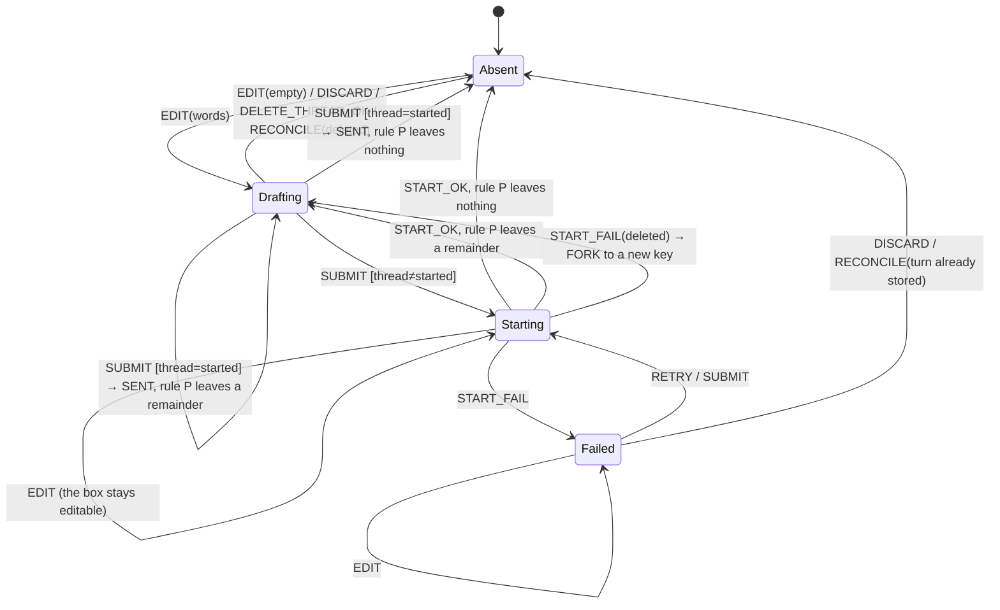

<!-- SPDX-FileCopyrightText: 2026 Alethia Labs <legal@alethialabs.io> -->
<!-- SPDX-License-Identifier: AGPL-3.0-only -->

# Elench drafts: one state machine, keyed by a conversation id that never changes

**Status:** proposed (2026-10-04) · **Issue:** #5464 · **Supersedes:** the draft store reverted from #5423 (head 2c1314267)

**Decision (proposed).** An unsent Elench message is an entry in one client-side store, keyed by
`(viewer, org, anchor, conversationId)`. The `conversationId` is the thread id from the moment the
conversation is created on screen: the client mints it, and `createThread` inserts the row under
that id. No transition re-keys, merges or relocates an entry. The composer is only a *view* of its
entry, so a remount is not an event. The store is held in memory and mirrored to `sessionStorage`
**one key per conversation**. A failed write removes that key, so storage is never staler than
memory. Words leave the store only through the transitions listed in invariant I3: the user
empties the box, a send hands them off, the user clicks Discard, the user deletes the thread,
reconciliation finds a tombstone or an already-stored turn, or the user signs out. Nothing evicts an
entry. Drafts are **not** stored server-side (see §6).

**Why.** #5423 grew a draft store over eight review rounds, and the patches followed a pattern:
keyed by lineage, then by conversation, then relocation, sent-pruning, tombstones, a cap, and
last-thread memory. Each fix opened the next blocker. Nearly every blocker sits in one of three
classes, and this design removes each class instead of patching its instances:

| Class | Blockers it produced on #5423 | Removed by |
|---|---|---|
| A key that changes under the words (epoch, `new` slot, relocation) | 4173571375, 4173571377, 4174362779, 4174713084, 4174713086 | Invariant **I2**: the key is the conversation id, fixed at birth |
| Two copies of one message (the box vs. `pending`/`failedStart`) | 4173297525, 4173404109, 4174362779 | Invariant **I1**: one text per conversation |
| A whole-map snapshot that diverges from memory after a failed write | 4174550045, 4174713084, 4174713086, 4174130695 | Invariant **I4**: per-key mirror, remove-on-fail |

---

## 1. Context: what the code does today (dev @ 857794cb9)

Every statement below was read from the tree; the line numbers are for that commit.

- **The draft is the composer's own Lexical state.** `ElenchComposer` reads `seed` once at mount
  (`apps/console/components/agent/elench/elench-composer.tsx:67-77`) and clears the editor after a
  send only when it still holds exactly the sent text (`elench-composer.tsx:188-193`). Anything
  that unmounts the composer drops the words.
- **Five things unmount the composer:**
  1. *Minimize/maximize.* `ElenchConversation` returns `<ElenchModal>` or `<ElenchPanel>` around
     the same `body` (`elench-conversation.tsx:502-531`). A view flip changes the parent element
     type, so the body remounts. The `useChat` instance lives above that branch
     (`elench-conversation.tsx:200-214`), so the store's "Flipping never remounts the chat"
     (`apps/console/lib/stores/use-elench-store.ts:100`) is true of the transcript and false of the
     composer.
  2. *Landing to docked.* The modal landing has its own composer
     (`elench-empty-landing.tsx:116-122`). It is rendered only while `isEmpty`
     (`elench-conversation.tsx:440`).
  3. *Close.* `ElenchSurface` returns `null` when `!open` (`elench-surface.tsx:21`). `close()` only
     sets `open: false` (`use-elench-store.ts:242`).
  4. *Lineage change.* The body's error boundary is keyed by `epoch`
     (`elench-conversation.tsx:435`), and `selectThread` and `newChat` both bump it
     (`use-elench-store.ts:264-272`).
  5. *Reload.*
- **A failed first send is component state.** `useElenchSend` keeps the pending turn in
  `useState`/`useRef` (`apps/console/components/agent/elench/use-elench-send.ts:72-78`) and reuses
  its id across retries (`use-elench-send.ts:92`). `ElenchConversation` resets it on every lineage
  change (`elench-conversation.tsx:270-273`). Retry submits the composer, and puts the failed
  attempt's state back when the box is empty (`elench-conversation.tsx:284-298`). So a close, a
  thread switch, New chat or a reload loses it.
- **Too-long is cleared only by a successful send.** `setError(null)` runs only on a send that went
  out (`use-elench-send.ts:116`).
- **Reopen resumes `resumeIdRef.current ?? list[0]`** (`use-elench-threads.ts:83`). An ephemeral
  conversation has a null id, so reopening lands on the newest thread.
  `listThreads` has no `catch` (`use-elench-threads.ts:80`). A rejection leaves `initialResolved`
  false, and the body stays on the skeleton.
- **Artifact "Open in new chat" creates a row eagerly with no messages**
  (`elench-conversation.tsx:373-380`). `listThreads` hides zero-message rows and deletes them after
  an hour (`apps/console/app/server/actions/agent.ts:128-143`, `:154`). `getThread` returns null
  for a tombstone and for a missing row alike (`agent.ts:162-172`).
- **`createThread` is idempotent by a read-then-insert** on `messages->0->>'id'`
  (`agent.ts:71-90`). The server mints the row id (`lib/db/schema/agent.ts:24`,
  `uuid().primaryKey().defaultRandom()`).
- **Org-level threads are user-scoped, not org-scoped.** `createThread` writes
  `org_id: owner` (`agent.ts:98-99`), and `withOwnerScope` sets both RLS variables to the user
  (`apps/console/lib/db/index.ts:93-98`). The same org-level thread is therefore listed in every org
  the user switches to. The route still runs tools under the active org
  (`app/api/agent/route.ts:171`, `:201`).
- **The Elench store is a module singleton with no org field** (`use-elench-store.ts:97-186`).
  `AppShell`, which mounts `ElenchSurface`, is mounted by `app/(private)/[org]/layout.tsx`
  (`components/shell/app-shell.tsx:6`, `:126`). An org switch can therefore remount the hooks while
  `open`, `ctx` and `threadId` carry over. A test must confirm this; it is inferred from the code,
  not observed.
- **Personal orgs share the URL segment `~`**, so the org slug alone does not identify a person
  (`use-elench-draft-owner.ts` at 2c1314267, and `useActiveOrgSlug`,
  `lib/stores/use-workspace-store.ts:123-135`).

## 2. Vocabulary

- **Conversation**: one thing on screen that can hold a transcript. It has a **conversation id**
  (a UUID), minted by the client at New chat, Open in new chat or first open. That id is also the
  thread id.
- **Thread status** of a conversation, as far as the client knows:
  - `local`: no row was ever created.
  - `started`: the row exists.
  - `gone`: the row was created, and the server now reports it absent.
- **Scope**: `(viewerId, orgSlug, anchor)`, where `anchor` is `org` or `project:<id>`. A **key** is
  scope plus conversation id.
- **Draft**: the text, mentions and serialized editor state that the composer of a conversation
  shows.
- **Start**: the first-send attempt of a `local` or `gone` conversation. Its fields are a `turnId`,
  minted once, a `phase` (`in-flight` or `failed`), and an `external` payload. `external` is non-null
  only when the turn did not come from the composer: a suggestion card, a seed prompt or a grid cell.
- **Unsent**: a conversation that holds words and is not `started` and listed. The rail shows it in
  an "Unsent" group (see §9, Q3).

## 3. The state machine

One machine per key. The entry is:

```ts
interface DraftEntry {
  key: DraftKey;                      // immutable (I2)
  thread: "local" | "started" | "gone";
  draft: { editor: string; text: string; mentions: Mention[] } | null;
  start: { turnId: string; phase: "in-flight" | "failed";
           external: { text: string; mentions: Mention[] } | null } | null;
  artifacts: string[];                // pending Open-in-new-chat placements (local only)
  title: string | null;               // last known title, for the Unsent label
  at: number;
}
```

Entry state is a derived value:

- **Absent**: no entry.
- **Drafting**: `draft` holds words, and `start` is null.
- **Starting**: `start.phase` is `in-flight`.
- **Failed**: `start.phase` is `failed`.

`thread` is a guard on transitions. It is not a separate machine. Persistence (`saved` or
`unsaved`) is tracked beside the entry, in a memory-only set.



### Events

| Event | Raised by |
|---|---|
| `OPEN_NEW(scope)` | New chat. Mints a fresh id, unless the active conversation is already an empty `local` one. |
| `OPEN_ARTIFACT_NEW(scope, artifactId)` | Artifact "Open in new chat". Mints an id and records the artifact. |
| `SELECT(key)` | Rail, recents, switcher, reopen, reload. Changes `activeKey[scope]` only. |
| `EDIT(key, editor)` | Composer update. Memory is written on every update; storage is debounced (§4). |
| `SUBMIT(key)` | Enter, Send, and Retry of a composer-origin start. |
| `SUBMIT_EXTERNAL(key, text, mentions)` | Suggestion, seed prompt, grid cell. |
| `START_OK(key)` / `START_FAIL(key, reason)` | `createThread` result. `reason` is `deleted` or `error`. |
| `SENT(key, sentText)` | Hand-off to `sendMessage`, or `START_OK`, because the first turn is stored with the row. |
| `RETRY(key)` | The thread-start card's Retry. |
| `DISCARD(key)` | An explicit Discard on the card or the Unsent entry. It is undoable through a toast. |
| `DELETE_THREAD_OK(key)` | `deleteThread` resolved in this tab. |
| `RECONCILE(key, status)` | After a successful `listThreads`/`threadStatuses`. `status` is `listed`, `unlisted`, `absent`, `deleted` or `stored-turn`. |
| `PERSIST_OK(key)` / `PERSIST_FAIL(key)` | The storage adapter. |
| `LOAD(scope)` / `SCOPE_CHANGE(scope)` | Surface mount, reload, org or account switch. |
| `SIGN_OUT` | The profile menu's sign-out. |

### Transitions

| # | From | Event | Guard | To | Effects |
|---|---|---|---|---|---|
| T1 | any | `OPEN_NEW` | the active conversation is `local` and Absent | (same key) | none: no clutter |
| T2 | any | `OPEN_NEW` | otherwise | new key, Absent | `activeKey[scope] := k'`. **The old entry is untouched.** |
| T3 | any | `OPEN_ARTIFACT_NEW` | — | new key, Absent, `artifacts=[a]` | entry persisted, so the artifact chip survives a reload. No row is created. |
| T4 | any | `SELECT(k)` | `k.scope = current` | unchanged | `activeKey[scope] := k`. Composer remounts with `key=k` and seeds from the entry. |
| T5 | Absent/Drafting | `EDIT(words)` | — | Drafting | memory now, storage debounced |
| T6 | Drafting | `EDIT(empty)` | `start=null`, `artifacts=[]` | Absent | `removeItem(k)` |
| T7 | Starting/Failed | `EDIT` | — | same | the draft is updated; `start` is kept |
| T8 | Drafting | `SUBMIT` | `thread=started` | via `SENT` | `sendMessage(newId)` |
| T9 | Drafting/Failed | `SUBMIT` | `thread≠started`, text non-empty, not too long | Starting | `turnId` is reused if present. `createThread(title, projectId, {id: turnId, text}, conversationId=k.id)` |
| T10 | Starting | `SUBMIT`/`RETRY` | — | Starting | refused (I7) |
| T11 | Failed | `SUBMIT` | box empty, `external=null` | Failed | nothing is sent. The card says the box is empty (Q4). |
| T12 | Starting | `START_OK` | — | via `SENT` | `thread:=started`; `start:=null`. `sendMessage(turnId)` runs **only if** `k` is mounted and active; otherwise the stored turn shows "No reply arrived" + Retry on open (`elench-conversation.tsx:223-230`). Pending `artifacts` are placed, and on failure a toast names the artifact. |
| T13 | Starting | `START_FAIL(error)` | — | Failed | the draft is untouched. The card says where the words are. |
| T14 | Starting | `START_FAIL(deleted)` | the id has a tombstone | Drafting under `k''` | **FORK**: the one re-key. `setItem(k'')`, then `removeItem(k)`. Notice: "That conversation was deleted. Your message is kept in a new one." |
| T15 | any with a draft | `SENT(k, s)` | — | Absent or Drafting | **Rule P**: if `draft.text` equals `s`, remove it. If it starts with `s`, keep the remainder. Otherwise keep it unchanged. Then persist or remove `k`. |
| T16 | Failed | `RETRY` | `external≠null` | Starting | send `external.text`. The card shows that text, so Retry sends what it states. |
| T17 | Failed | `RETRY` | `external=null` | as `SUBMIT` | Retry is Enter |
| T18 | any | `DISCARD` | — | Absent | `removeItem(k)`; an undo toast holds the entry for one toast lifetime |
| T19 | any | `DELETE_THREAD_OK` | — | Absent | `removeItem(k)`. The confirm dialog counts the unsent message. |
| T20 | any | `RECONCILE(listed)` | — | unchanged | — |
| T21 | any | `RECONCILE(unlisted)` | the row is live but has 0 messages | unchanged; shown under Unsent | — |
| T22 | `started` | `RECONCILE(absent)` | — | `thread:=gone`; shown under Unsent | notice: "'<title>' is no longer available. Your unsent message is kept under Unsent." Never "deleted". |
| T23 | any | `RECONCILE(deleted)` | a tombstone exists | Absent | notice: "Discarded the unsent message of a conversation you deleted." |
| T24 | Failed/Drafting | `RECONCILE(stored-turn)` | the server row's first message id is `start.turnId` | Absent or Drafting | treated as `START_OK` without sending, for example after another tab's Retry. Rule P runs against the stored text. |
| T25 | — | `PERSIST_FAIL(k)` | — | unchanged | `removeItem(k)`, then add `k` to `unsaved`. A notice is raised when `unsaved` goes from ∅ to non-∅. |
| T26 | — | `PERSIST_OK(k)` | — | unchanged | remove `k` from `unsaved` |
| T27 | — | `LOAD(scope)` | — | entries of the scope | read with `scope` as the prefix. Each value is zod-validated; an invalid one is reported and removed. Then `RECONCILE` runs after the server answers. |
| T28 | — | `SCOPE_CHANGE(s')` | — | — | the selector shows only `s'`. `activeKey := activeKey[s']`. In-flight effects carry their own key and never read the active one. |
| T29 | — | `SIGN_OUT` | — | all of the viewer's entries are Absent | memory and storage cleared (Q8) |

### Invariants

- **I1. One text per conversation.** A start never copies composer text. Retry of a composer-origin
  start submits the draft. Only `external` holds text of its own, and the card shows that text.
- **I2. The key is immutable.** It is `(viewer, org, anchor, conversationId)`, and the conversation
  id is the thread id from birth. Only T14 (FORK) re-keys, and it moves the words to a new key; it
  never merges them into another key.
- **I3. Words leave only by T6, T15, T18, T19, T23, T24 or T29.** No cap, remount, navigation, lineage
  change or storage failure removes an entry from memory.
- **I4. Storage is never older than memory for a key.** Each key is its own storage item. A failed
  `setItem` is followed by `removeItem`, which frees space and cannot fail on quota. A send or discard
  is a `removeItem`.
- **I5. Every entry with words is reachable.** It is the active conversation, a listed thread
  (marked "draft" in the rail), or an Unsent rail entry.
- **I6. Scope isolation.** Every read selects by scope. `SUBMIT`/`RETRY` assert
  `key.scope === currentScope` before any network call.
- **I7. At most one start in flight per key.** `createThread` is idempotent on the conversation id
  (a primary-key conflict), so a lost response and a retry converge on one row.
- **I8. Epoch is the `useChat` lineage only.** It never appears in a key.

## 4. Where state lives

| State | Lives in | Scope and key | Lifetime |
|---|---|---|---|
| `DraftEntry` (authoritative) | a new zustand module store, `apps/console/lib/stores/elench-drafts.ts` | `DraftKey` | the JS realm. Survives every remount, close, switch and org navigation. |
| `DraftEntry` mirror | `sessionStorage["alethia:elench:draft:v2:" + encode(key)]` | one item per key | the tab. Survives a reload and a reopened closed tab. Dropped on tab close. |
| `activeKey[scope]` | the same store, plus `sessionStorage["alethia:elench:active:v2:" + encode(scope)]` | scope | the tab |
| `unsaved: Set<key>`, the notice queue (acknowledged by id) | the store, memory only | — | the realm |
| Transcript | `useChat` (unchanged) | `elenchChatId(ctx, epoch)` (`use-elench-store.ts:284-287`) | the lineage |
| Thread rows, first turn, tombstones | Postgres `agent_threads` (unchanged except that the client supplies the id) | owner (RLS) | as today |

Debounce: memory is written on each Lexical update with a non-selection dirty set. Serialization
and `setItem` are debounced at 300 ms, and flushed on composer unmount, `pagehide`,
`visibilitychange:hidden` and before `SUBMIT`. The flush targets the composer's **own** key,
captured at mount, never `activeKey` (case 17).

## 5. Failure handling for every external call

| Call | Failure | Handling |
|---|---|---|
| `createThread` | throws, or a network error | T13 Failed. The words stay in the box. The card reads "Could not start the conversation. Your message is in the box." It does not claim more than that (case 20). |
| `createThread` | committed, response lost | Retry inserts under the same id. A PK conflict returns the existing row (I7) and rewrites the turn while the row holds one message, as `agent.ts:79-90` does today. |
| `createThread` | the id belongs to a tombstone | T14 FORK |
| `createThread` | over the limit | never called: refused before the start, as `use-elench-send.ts:84-87` does today |
| `sendMessage` / route | 4xx, 5xx or stream error after the hand-off | not a draft event. The words are in the transcript (and stored with the row for a first turn), and `ChatError` with `regenerate` owns them. Later-turn transcripts are out of scope (§8). |
| `listThreads` | throws | **No RECONCILE.** Absence is never inferred from a failure. The active entry renders, and an inline error with Retry replaces the skeleton. This also fixes the wedge at `use-elench-threads.ts:80-86`. |
| `threadStatuses` (new) | throws | no RECONCILE for those keys; they stay as they were |
| `getThread` (select) | throws or null | `activeKey` does not move. A toast reports it. A null result is followed by a status check that feeds RECONCILE. |
| `deleteThread` | throws | no T19. The entry stays. |
| `openArtifactOnGrid` | throws | the toast names the artifact. The artifact is removed from `artifacts`, and the message has already gone out. |
| `sessionStorage` getter | throws (`SecurityError`) | memory-only mode for the realm. One notice per scope: "can't be kept across a reload in this tab". |
| `setItem` | quota or any error | T25 |
| `removeItem` | throws | memory-only mode. Every key is marked `unsaved`. Residual risk: an older item may survive. This is reachable only if storage access is revoked mid-session, after a successful read (§9, Q10). |
| `JSON.parse` / zod on load | invalid item | removed. It is reported to telemetry with no content. |

## 6. Why not server-side drafts

Server-side drafts would remove the storage-quota and stale-snapshot classes, survive a tab close,
and follow the user across devices. They were considered and rejected for four reasons:

1. **The headline case is the one the server cannot serve.** A failed first send is, by definition,
   a moment when `createThread` could not reach or write the database. A store that is only on the
   server fails exactly then. The client store is therefore required anyway, and a server store
   would be a **second** copy of the same words. Two copies of one message are the class that cost
   #5423 its rounds (I1).
2. **It persists words the user chose not to send.** People paste kubeconfigs, tokens and
   connection strings into a chat box and then delete them. A server draft table writes those
   strings to Postgres, with backups, before any decision to send. That widens the
   keyless/no-key-leakage surface (`.claude/skills/alethia-security-review/SKILL.md`).
   `sessionStorage` keeps them in the tab, and they go when the tab goes.
3. **Write cost and flush reliability.** A 100,000-character message
   (`MAX_USER_MESSAGE_CHARS`) written on a debounce is a large server-action payload per pause.
   A reload cannot flush it: server actions cannot ride `sendBeacon`, so the last 300 ms would need
   a separate route.
4. **Cross-tab and cross-device conflicts.** Two tabs on one thread would need versioned
   last-writer-wins. Today two tabs cannot interfere, because `sessionStorage` is per tab.

`localStorage` was rejected for reasons 2 and 4: it keeps pasted secrets on disk after the tab
closes, and it shares one key between tabs.

**What does move server-side** is the conversation's **identity**. The client mints the thread id,
and `createThread` accepts it. This removes re-keying (I2), turns the read-then-insert idempotency
into a primary-key guarantee, and closes the concurrent-retry follow-up listed in #5423.

## 7. Cases, transitions and tests

The source is the issue's 17 acceptance criteria and every inline thread, review summary and
advisory comment on #5423. Rows 18-34 are cases the issue does not list.

Tests that drive the real `ElenchSurface`, `useElenchThreads`, `ElenchConversation`, store and
Lexical composer stack go in `apps/console/tests/components/elench-drafts-surface.test.tsx`
(**S**), with server actions faked in memory as #5423's harness did. Reducer and storage-adapter
tests go in `apps/console/tests/lib/stores/elench-drafts.test.ts` (**U**). Server tests go in
`apps/console/tests/actions/agent.test.ts` (**A**). Each test must fail on dev @ 857794cb9 **on
its assertion**, not at import (cf. review 5402417260, advisory 1). Where the code under test is
new, the test is mutation-checked: revert the transition's effect, and the test must fail.

| # | Case | Source | Transitions | Test |
|---|---|---|---|---|
| 1 | Minimize/maximize keeps the draft and an edit after a failed start; Retry sends what the box shows | AC1; 4173404109 | T4, T7, T17 | S › `minimize and maximize keep the edit after a failed start, and Retry sends it` (modal→panel, panel→modal landing) |
| 2 | Text typed during an in-flight first send survives landing → docked | AC2; 5969745919 adv 1 | T7, T12, T15 | S › `words typed while the thread is created stay in the docked box, minus what was sent` |
| 3 | Close/reopen keeps a draft and a failed start, for a user **with** threads | AC3; 4173571375; 5969745919 adv 2 | T4, T28, I8 | S › `reopen with a non-empty thread list returns to the failed new conversation` and S › `reopen restores a resumed thread's draft` |
| 4 | Each thread keeps its own draft; re-selecting the same thread keeps it | AC4; 4173571377 | T4, I2 | S › `A→B→A→B keeps each draft` and S › `re-selecting the active thread keeps its draft` |
| 5 | New chat starts empty and keeps the previous draft or failed start; no single slot | AC5; 4173571377 | T1, T2 | S › `New chat twice keeps both unsent conversations under Unsent` |
| 6 | Reload keeps the draft and failed start and lands where the user was, or says where the words are | AC6; 5970188569 adv 1; 5970752756 adv 1 | T27, `activeKey` mirror, T21/T22 | S › `reload lands on the active conversation with its draft` (`vi.resetModules`) |
| 7 | Org/account switch: A's words never seed B's composer, Retry never sends under B, and a switch mid-`listThreads` neither wedges nor writes A's state under B | AC7; 5970188569 adv 2; 5970752756 adv 3 | T28, I6, §5 `listThreads` | S › `org switch shows B's empty box and keeps A's failed start for A` and S › `scope change during listThreads settles for the new scope only` |
| 8 | A bound never evicts the shown conversation or a failed start; any eviction is visible | AC8; 4173796114; 5970752756 adv 2; 5971076371 adv 1 | I3 (no eviction exists), T25 | U › `no transition removes an entry except the listed ones` (property test over random event sequences) and S › `500 conversations with words are all kept` |
| 9 | A storage failure is surfaced, and told again after recovery then failure | AC9; 4174130695 | T25, T26 | U › `fail, recover, fail raises two notices` |
| 10 | After a failed write, a reload never brings back sent, cleared or discarded words, including the prefix case ("deploy" → "deploy now") | AC10; 4174550045; 5973251083 adv 3 | T15, T18, T19, T25, I4 | S › `sent, discarded and deleted words never return after a reload with full storage` (both probes from 4174550045 plus the prefix probe) |
| 11 | A later send in a thread born from New chat never prunes another conversation's draft | AC11; 4174713084 | I2, T15 on its own key | S › `a second send in a new thread leaves New chat's draft stored` |
| 12 | Relocation never hides a failed start, and Retry never sends other words | AC12; 4174362779 | relocation removed; T22 keeps its own key; T16/T17 | S › `a gone thread's draft and a failed start stay two entries; Retry sends the card's or the box's own words` |
| 13 | Relocated then sent never comes back after a reload | AC13; 4174713086 | no relocation; T15 removes the same key | S › `sending from an Unsent entry removes it for good` |
| 14 | An artifact Open-in-new-chat draft survives a reload and the 1h reap, and is never hidden or labelled "deleted" | AC14; 4173922105; 4174130689 | T3 (no row until first send), T12 places the artifacts | S › `artifact new chat creates no row; draft and chip survive reload; first send places the artifact` |
| 15 | A reaped thread's draft is kept, and the notice does not say "deleted" | AC15; 4174130689; 5971810475 adv 1 | T22 | S › `a reaped thread's draft moves under Unsent with "no longer available"` |
| 16 | A thread the user deleted (here or in another tab) is not resurrected | AC16; 4174550045 probe B | T19, T23 | S › `delete here, and delete elsewhere then reload: words discarded with the deleted notice` |
| 17 | No path writes one conversation's words into another (thread, project or org) | AC17 | I2, I6, §4 flush to the composer's own key | S › `a switch inside the debounce flushes to the old key` and U › `no event writes a key other than its own` |
| 18 | Retry with an emptied box sent text the user had deleted | 5970188569 adv 3 | T11 | S › `Retry with an emptied box sends nothing and says so` |
| 19 | Typing during the in-flight first send left the sent text in the box, so Enter sent it twice | 5973688789 adv 1 | T15 rule P | U › `rule P keeps only the unsent remainder` |
| 20 | The card said "has not been lost" while a close or reload lost it | 5973688789 adv 2 | T13 copy | S › `the thread-start card names where the words are` |
| 21 | Per-keystroke serialization near 100k characters | 5970188569 adv 5 | §4 debounce | U › `selection-only updates write nothing; storage writes are debounced` |
| 22 | A second account in the same tab, where every personal org is `~` | 5970702244 (reasoning for the person in the key) | key includes viewer, I6 | S › `account B in the same tab never sees A's draft` |
| 23 | Acknowledging notices wholesale dropped one not yet shown | 5971810475 adv 2 | notices acknowledged by id | U › `ack removes only the shown notice ids` |
| 24 | An org switch after load wrote A's thread as B's remembered conversation | 5971076371 adv 3 | T28: `activeKey` written per scope from the key's own scope | S › `org switch after load leaves B's active conversation as it was` |
| 25 | An owner change mid-load wedged the skeleton | 5970752756 adv 3 | T28, §5 | covered by #7's second test |
| 26 | A `sessionStorage` getter that throws (`SecurityError`) | probe in 5970752756 | §5 memory-only | S › `with storage that throws on access, everything works in memory and one notice shows` |
| 27 | The too-long card stays after the text is shortened | 5970188569 adv 4; `use-elench-send.ts:116` | the card derives from the entry's text, not a sticky error | S › `the too-long card clears once the box is under the limit` |
| 28 | **New.** A duplicated browser tab copies `sessionStorage`; a send in one tab leaves the copy in the other | design review | T24 (the turn id is stored server-side) | S › `a failed start retried in another tab is dropped as sent on reconcile` |
| 29 | **New.** Sign-out leaves unsent words in the tab's storage for the next person | design review | T29 | S › `sign-out clears this viewer's entries` |
| 30 | **New.** The store keeps `ctx`/`threadId` across an `[org]` remount (`use-elench-store.ts:97-186`) | design review | T28 | covered by #7 and #24 |
| 31 | **New.** A send from a stale tab into a thread deleted elsewhere | derived from 5402417260 adv 2 | T14 FORK | A › `createThread with a tombstoned id reports deleted` and S › `send into a deleted conversation keeps the words in a new one` |
| 32 | A draft kept for an unlisted thread is unreachable | 4174130689 P2; 5970752756 adv 4 | I5, T21 | S › `an unlisted live thread's draft is shown under Unsent` |
| 33 | A start that completes after a close or org switch sends into an unmounted chat | design review (elench-surface.tsx:21) | T12 guard | S › `close during createThread: reopen shows the stored turn with "No reply arrived"` |
| 34 | A failed suggestion, seed or cell prompt is kept and re-sent as it was | 5969533222; 5969992305 | T16 | S › `a failed seed prompt survives a reload and Retry sends the card's text` |

Count: 34 cases (17 from the issue, 17 added).

## 8. Out of scope

- **Later turns that fail after hand-off.** A user message in a started thread whose route fails is
  only in the client transcript until `onFinish` saves it. That is server-side transcript saving
  (`lib/agent/thread-transcript.ts`), which the issue excludes.
- Reloading while a first turn is still streaming shows it as unanswered, and Retry runs it twice.
  This is a #5423 follow-up about streams, not drafts.
- Cross-device or cross-tab draft sync (§6).
- Whether org-level threads should be org-scoped server-side (Q6). This design only keys drafts by
  org.
- Undo of individual edits across a remount: Lexical history is per mount.

## 9. Open questions for the maintainer

1. **Client-minted thread ids.** `createThread` would take the conversation id (a v4 UUID, which
   `z.uuid()` already accepts at `route.ts:85`) and insert with `ON CONFLICT (id) DO NOTHING`. This
   touches `app/server/actions/agent.ts` and `tests/actions/agent.test.ts`, which are outside
   #5464's `scope:`. It also needs a pass of `alethia-security-review`. The client can choose an
   id, but RLS still bounds every read, and a collision with another owner's row fails closed.
   Approve the scope widening?
2. **Lazy artifact Open-in-new-chat.** The grid would show the artifact after the first send, not
   at click. The alternative is to create the row eagerly and store a non-empty system marker so the
   reap skips it. The lazy option is recommended: it adds no message kind and no reaped rows.
3. **The "Unsent" rail group** is new UI. It is the only way to satisfy I5 for `local` and `gone`
   conversations. Should it be a `class:ui` draft PR with a design decision, per
   `.claude/COORDINATION.md`?
4. **Retry with an emptied box** (T11) sends nothing and says so. Putting the failed text back would
   require a second copy of the message, which violates I1. Accept?
5. **No count cap.** The only bound is the storage quota, and hitting it is announced (T25), never
   evicted. Do you want a display limit on the Unsent group, for example the 20 newest plus "more"?
6. **Org-level threads are user-scoped** (`agent.ts:98-99`, `lib/db/index.ts:93-98`), so one thread
   appears in every org while its tools run under the active org. Drafts are keyed by org because
   mentions name org resources. Is the cross-org thread intended, or should it get its own issue?
7. **Deleted elsewhere** is detectable only while the tombstone lives (1 day, `agent.ts:139-140`).
   After that, the words are kept under Unsent, not discarded. This fails safe. Accept?
8. **Sign-out** clears this viewer's entries (T29). Should it confirm first when unsent words exist?
9. **Rule P** (keep the remainder after the sent prefix) versus leaving the box as typed, which risks
   a duplicate send.
10. **`removeItem` throwing mid-session** is the one residual path to a stale item (§5). Accept it
    as an assumption, or clear all Elench keys at the next `LOAD` when the previous realm ended in
    memory-only mode? The second option needs a marker key, which a full storage refuses.

## 10. Migration and rollout from today's code

Three PRs, each landing the §7 tests it makes pass. Nothing ships behind a flag: the old behaviour
loses words, so there is nothing to keep.

**PR 1: server (after Q1).**
- `createThread(title, projectId, firstTurn, id?)` (`agent.ts:56-110`): insert with the client
  `id`. The read-then-insert lookup at `agent.ts:71-90` becomes a PK conflict plus the existing
  one-message rewrite. A tombstoned id raises a typed `ThreadDeleted`.
- New `threadStatuses(ids)`, RLS-scoped. It returns `listed | unlisted | deleted | absent`, plus the
  first message id for T24. It reads tombstones, which `getThread` (`agent.ts:162-172`) filters out.
- Tests: A rows for #31 and I7.

**PR 2: the store and the composer.**
- New `lib/stores/elench-drafts.ts`: a pure `reduce(entries, event) → {entries, effects}`, a
  `StorageAdapter` (sessionStorage, plus an in-memory fake that can refuse writes, both used in
  tests), and selectors `useDraft(key)` and `useUnsent(scope)`.
- `ElenchComposer` (`elench-composer.tsx:58-111`): replace `seed`, `handleRef` and `restore` with
  `draftKey`. Seed from the entry at mount and dispatch `EDIT`. The clear guard at `:188-193` moves
  into rule P. The `ElenchComposerHandle` is deleted.
- `useElenchSend` (`use-elench-send.ts:66-135`): `pending`/`pendingRef`/`startingRef` become
  `entry.start` and I7. The hook becomes a thin dispatcher, or is deleted if nothing is left.
- `ElenchConversation`: delete `resetSend` on `chatId` (`:270-273`), `onRetryStart` (`:284-298`)
  and `failedState` seeding (`:450`, `:477`). Pass `draftKey` to both composers.
- `use-elench-store.ts`: add `conversationId` (never null). `threadId` keeps its meaning, so
  `prepareBody` (`elench-conversation.tsx:158-195`) is unchanged. `newChat` mints an id
  (`:267-272`).
- Tests: S/U rows 1-5, 8-11, 17-21, 23, 26, 27, 34.

**PR 3: threads, reconciliation and scope (a `class:ui` draft if Q3 says so).**
- `useElenchThreads`: resume `activeKey[scope]` instead of `resumeIdRef ?? list[0]`
  (`use-elench-threads.ts:61-64`, `:83`). Wrap `listThreads` (`:80`) in a catch, and start a
  generation-guarded load per scope. Dispatch `RECONCILE` only after success. `deleteThread`
  (`:139-150`) dispatches `DELETE_THREAD_OK`. `startThread` (`:127-136`) passes the conversation id.
- `openArtifactInNewChat` (`elench-conversation.tsx:373-380`) becomes `OPEN_ARTIFACT_NEW`. The chip
  above the composer has a Remove button.
- The Unsent rail group, the notices with copy from §3/§5, and sign-out (`components/shell/sidebar-profile.tsx:76`).
- Tests: S rows 6, 7, 12-16, 22, 24, 28, 29, 31-33.

**Comments to correct on the way.** `use-elench-store.ts:100` ("Flipping never remounts the chat")
should say *transcript*. The composer under it does remount.

**Rollout.** The storage keys are `v2`, and nothing reads the v1 keys of #5423's reverted store.
The cleanup is one `removeItem("alethia:elench:drafts:v1")` at the first `LOAD`, in case a tab
still holds the 2c1314267 build. That commit was force-pushed away and never merged, so this is only
hygiene for tabs that ran a preview of it.
